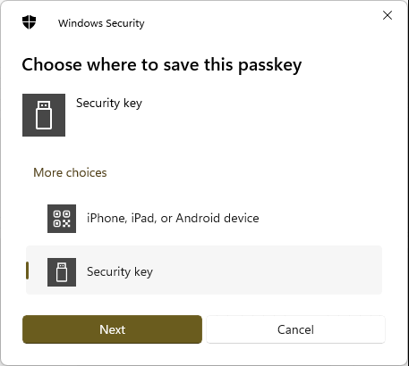
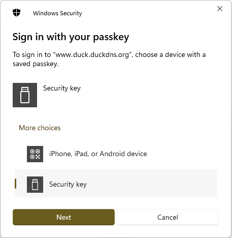

# YARP w/ WebAuthn
[WebAuthn](https://en.wikipedia.org/wiki/WebAuthn) for [YARP](https://dotnet.github.io/yarp/).  Concept borrowed from 
[NginxWebAuthn](https://github.com/mguinness/NginxWebAuthn) repository.

## Introduction
This project is a simple ASP.NET Core application that uses YARP (Yet Another Reverse Proxy) to proxy requests to a backend server and WebAuthn to secure the website.

If you have a home server and you want to protect websites behind a reverse proxy, use this project that requires authentication to access them.

## Prerequisites

* [Duck DNS](https://www.duckdns.org/) or a similar service is required to get a domain name for your home server, like example.duckdns.org
* WebAuthn requires SSL.  You will need to have a valid SSL certificate for your domain using [Let's Encrypt](https://letsencrypt.org/) or a similar provider
* Use [Certbot](https://certbot.eff.org/) to generate a wildcard certificate, i.e. *.example.duckdns.org

A wildcard certificate is helpful as you only need one certificate to cover multiple subdomains, i.e. app1.example.duckdns.org, app2.example.duckdns.org etc.

You can use a Docker image to generate the certificates using [Let's Encrypt for Duck DNS](https://hub.docker.com/r/maksimstojkovic/letsencrypt).

Once the certifcates are generated you will need the files `fullchain.pem` and `privkey.pem` for the configuration below.

## Getting Started
Modify `appsettings.json` file changing the lines marked with `+` to match your configuration.

```diff
"Kestrel": {
  "Certificates": {
    "Default": {
+     "Path": "fullchain.pem",
+     "KeyPath": "privkey.pem"
    }
  }
},
"ReverseProxy": {
  "Routes": {
    "route1": {
      "ClusterId": "cluster1",
      "AuthorizationPolicy": "default",
      "Match": {
+       "Hosts": [ "www.example.duckdns.org" ],
        "Path": "{**catch-all}"
      }
    }
  },
  "Clusters": {
    "cluster1": {
      "Destinations": {
        "destination1": {
+         "Address": "http://localhost:5000/"
        }
      }
    }
  }
},
"Hosts": {
+ "www.example.duckdns.org": {
+ }
}
```

## Usage
Run the ASP.NET Core application and navigate to https://www.example.duckdns.org/ (substituting `example` with your name).  To register a new security key change the url to `/auth/registerkey` to register it.



After the final prompt you will get a message that includes the public key.  Copy and paste it into the `Hosts` section in the appsettings.json file.  You can have multiple security keys per host, repeat the process as necessary.

After restarting the application and navigating to the website you should be automatically redirected to `/auth/login` where you should be prompted to insert your security key to authenticate.



After signing in with your security key you will be redirected to the home page where your destination website should now be proxied by YARP.

## Conclusion
You will now be able to access your applications over the internet in a secure manner, protected by both SSL and WebAuthn.

Contributions for this project are welcomed, especially with regards to documentation.  If there are omissions in the instructions please create a PR to fill in the gaps.